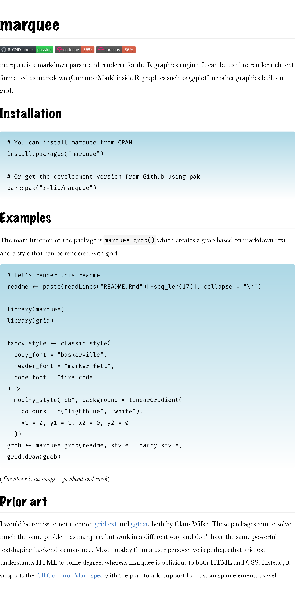

<!-- README.md is generated from README.Rmd. Please edit that file -->

# marquee 

<!-- badges: start -->

[](https://github.com/r-lib/marquee/actions/workflows/R-CMD-check.yaml)
[](https://CRAN.R-project.org/package=marquee)
[](https://app.codecov.io/gh/r-lib/marquee)
<!-- badges: end -->

marquee is a markdown parser and renderer for the R graphics engine. It
can be used to render rich text formatted as markdown (CommonMark)
inside R graphics such as ggplot2 or other graphics built on grid.

## Installation

``` r
# You can install marquee from CRAN
install.packages("marquee")

# Or get the development version from Github using pak
pak::pak("r-lib/marquee")
```

## Examples

The main function of the package is `marquee_grob()` which creates a
grob based on markdown text and a style that can be rendered with grid:

``` r
# Let's render this readme
readme <- paste(readLines("README.Rmd")[-seq_len(17)], collapse = "\n")

library(marquee)
library(grid)

fancy_style <- classic_style(
  body_font = "baskerville",
  header_font = "marker felt",
  code_font = "fira code"
) |>
  modify_style("cb", background = linearGradient(
    colours = c("lightblue", "white"),
    x1 = 0, y1 = 1, x2 = 0, y2 = 0
  ))
grob <- marquee_grob(readme, style = fancy_style)
grid.draw(grob)
```



(*The above is an image – go ahead and check*)

## Prior art

I would be remiss to not mention
[gridtext](https://github.com/wilkelab/gridtext) and
[ggtext](https://github.com/wilkelab/ggtext), both by Claus Wilke. These
packages aim to solve much the same problem as marquee, but work in a
different way and don’t have the same powerful textshaping backend as
marquee. Most notably from a user perspective is perhaps that gridtext
understands HTML to some degree, whereas marquee is oblivious to both
HTML and CSS. Instead, it supports the [full CommonMark
spec](https://spec.commonmark.org/) with the plan to add support for
custom span elements as well.
